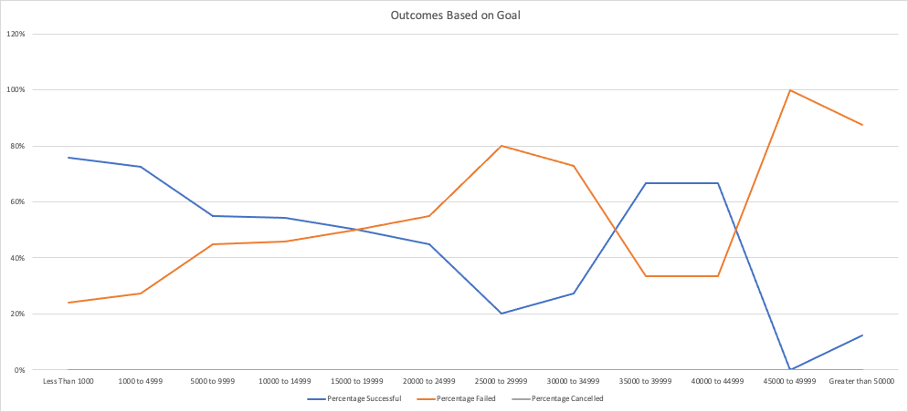
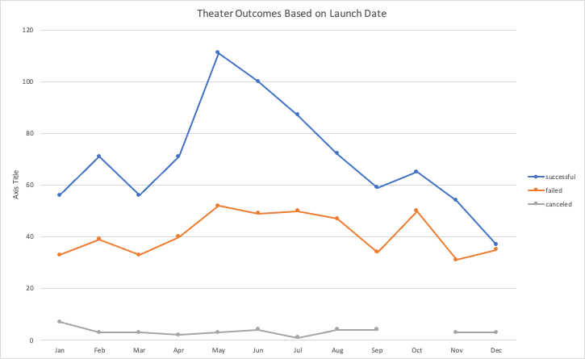

# Kickstarting with Excel

## Overview of Project
The analysis of the kickstarted dataset intends to help Louise understanding the information through analysis and visualization of relevant information to her requirements.

### Purpose

The purpose of the analysis is to discover trends in the data set that will help Louise to plan the launch of her play "Fever" by visualizing and analyzing campaign outcomes based on launch dates and funding goals. 

## Analysis and Challenges

### Analysis of Outcomes Based on Launch Date

The outcomes based on launch date provide an important information for Louise; its clear that that May - June it's the best time to launch a play, as around 66.8% of launched theater campaigns were successful vs 31,32% and 32,02% of failed campaigns during the same months. These outcomes also tell us that starting from October until the end of December, it's the worst time to launch a successful campaign. 

### Analysis of Outcomes Based on Goals

Overall, having the data from successful, failed and cancelled of plays' campaigns, 66,28% were successful. However, it highly depends on how high the goals were set. As many of us would think, the lowest the goal, the highest chance to have a successful campaign; nevertheless, the data shows a very interesting trend which is that from goals $30,000.00 to $44,999.00, the % of success goes up to 67% but only in 9 projects. The majority of projects (51%) have a goal of $1000,00 to $4,999.00 with a 73% success rate.

### Challenges and Difficulties Encountered

- The first issue was filtering the pivot table: This challenge was overcome by formating the cell and selecting group to months the information, as at first I was just getting the information by years. 

- Another challenge was using the COUNTIFS function. The formulas were very long and as it has to be typed manually I have a couple mistakes that were afecting the final graph and not letting it look as it should be. I worked on this issue by counting the total projects on the kickstarter sheet by filtering information so I was able to get the information and compared it with the totals from my "Outcomes based on goal" table.

## Results

- What are two conclusions you can draw about the Outcomes based on Launch Date?

- > The best time to launch a project based on theater is May - June were 25,14% of the total successsful projects were run. 
- > December appears to be the worst time to launch a theater project as in this data set, 46,67% failed. Furthermore, this is the month with less projects launched. 

- What can you conclude about the Outcomes based on Goals?

- > The most likely goal to be achieved is from $1,000.00 to $4,999.00, which is also the 51% of the total projects.
- > From the plays projects, 66.28% were successful and data shows that a high goal means a higher percentage to fail.

- What are some limitations of this dataset?

We cannot really compare the whole information according to goals because we have different currencies, it only can be done one by one.

- What are some other possible tables and/or graphs that we could create? 

We could create the same tables but we can filter countries and currencies 

We can also take into account the backers numbers and create a pivot table to display the connection with the success of the projects.

